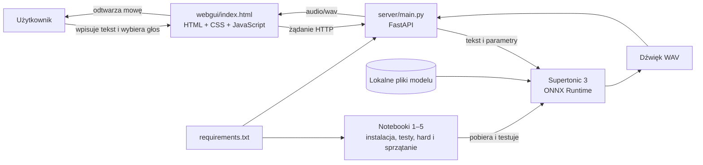

# Architektura projektu TTS z Supertonic

Podczas warsztatów zbudujemy małą, działającą lokalnie aplikację do zamiany tekstu na mowę. Użytkownik wpisze tekst na stronie internetowej, a serwer Pythona przekaże go do modelu Supertonic 3 i zwróci wygenerowany dźwięk.

Dokument opisuje zaimplementowany stan warsztatowej aplikacji.

## Co zostanie zbudowane?

Rezultatem będzie lokalna aplikacja składająca się z:

- interfejsu użytkownika w `webgui/index.html`,
- lokalnego API uruchamianego przez `server/main.py`,
- modelu Supertonic 3 działającego przez ONNX Runtime,
- pięciu notebooków Jupyter: instalacyjnego, podstawowego, zaawansowanego, zadania hard o odpowiedzi zdaniami i czyszczącego,
- pliku `requirements.txt` z zależnościami Pythona,
- katalogów `outputs/` i `generated_audio/` na wyniki ćwiczeń.

## Schemat architektury

Przeglądarka odpowiada za zebranie danych i odtworzenie rezultatu. Obliczenia związane z syntezą wykonuje lokalny serwer Pythona.



## Odpowiedzialności elementów

| Element            | Odpowiedzialność                                                       |
| ------------------ | ---------------------------------------------------------------------- |
| `webgui/index.html` | Formularz, wybór ustawień, wysłanie zapytania i odtworzenie audio     |
| `server/main.py`    | Walidacja danych, obsługa HTTP, uruchomienie syntezy i zwrócenie WAV  |
| Supertonic 3       | Zamiana tekstu i parametrów głosu na mowę                              |
| ONNX Runtime       | Lokalne wykonanie modeli neuronowych Supertonic                        |
| Notebooki 1–5      | Instalacja, test modelu, eksperymenty, zadanie hard i sprzątanie      |
| `requirements.txt` | Powtarzalna instalacja bibliotek wymaganych przez projekt              |
| Katalogi wynikowe  | JSON-y i WAV-y utworzone przez notebooki oraz serwer                   |

## Przepływ pojedynczego zapytania

1. Użytkownik wpisuje tekst i wybiera parametry głosu.
2. JavaScript w `index.html` wysyła dane do lokalnego API.
3. Serwer sprawdza, czy żądanie zawiera poprawny tekst i obsługiwane parametry.
4. Supertonic generuje próbki audio.
5. Serwer koduje odpowiedź jako WAV i odsyła ją do przeglądarki.
6. Przeglądarka tworzy tymczasowy adres audio i uruchamia odtwarzacz.

## Planowany kontrakt lokalnego API

Minimalny kontrakt zostanie potwierdzony podczas implementacji:

| Metoda i ścieżka | Cel                           | Odpowiedź        |
| ---------------- | ----------------------------- | ---------------- |
| `GET /`          | Udostępnienie interfejsu      | `index.html`     |
| `GET /health`    | Sprawdzenie gotowości serwera | JSON ze statusem |
| `POST /api/tts`  | Wygenerowanie mowy z tekstu   | `audio/wav`      |

Przykładowe dane wysyłane do syntezy:

```json
{
  "text": "Dzień dobry! To jest test syntezy mowy.",
  "voice": "F2",
  "language": "pl"
}
```

## Granice projektu

Warsztat koncentruje się na jednym lokalnym użytkowniku i prostym przepływie TTS. Pierwsza wersja nie wymaga:

- kont użytkowników ani logowania,
- bazy danych,
- przechowywania historii w chmurze,
- płatnego API,
- wdrożenia publicznego,
- klonowania głosu konkretnej osoby.

Takie ograniczenie pozwala skupić się na Pythonie, modelu TTS i komunikacji przeglądarki z lokalnym serwerem.

## Wymagania wstępne

### Sprzęt i system

- komputer z systemem Windows, macOS lub Linux,
- wolne miejsce na środowisko Pythona i pliki modelu,
- działające wyjście audio: głośniki albo słuchawki,
- połączenie z internetem podczas pobierania repozytorium, pakietów i modelu.

### Oprogramowanie

- Python w wersji zgodnej z pakietami zapisanymi w `requirements.txt`,
- `pip` i moduł `venv`,
- Jupyter Notebook lub IDE obsługujące pliki `.ipynb`,
- aktualna przeglądarka internetowa,
- terminal: PowerShell, Terminal albo powłoka systemowa,
- Git jest zalecany, ale repozytorium można również pobrać jako ZIP.

### Wiedza uczestnika

Wystarczy podstawowa umiejętność:

- uruchamiania poleceń w terminalu,
- czytania prostego kodu Pythona,
- rozpoznawania podstawowej struktury HTML.

Znajomość uczenia maszynowego, ONNX, FastAPI ani budowy modeli TTS nie jest wymagana.

## Kompetencje zdobywane podczas warsztatów

Po ukończeniu warsztatów uczestnik będzie potrafił:

### TTS i modele AI

- wyjaśnić, jak tekst jest zamieniany na falę dźwiękową,
- odróżnić model TTS od klonowania głosu,
- uruchomić Supertonic 3 lokalnie,
- porównać głosy, języki i podstawowe parametry syntezy,
- ocenić zrozumiałość, naturalność i stabilność wygenerowanej mowy.

### Python i środowisko pracy

- utworzyć i aktywować środowisko `.venv`,
- instalować zależności z `requirements.txt`,
- korzystać z notatnika Jupyter do eksperymentów,
- zapisać wynik syntezy jako plik audio,
- rozpoznać podstawowe błędy instalacji lub uruchomienia modelu.

### Budowanie prostej aplikacji

- uruchomić lokalny serwer HTTP w Pythonie,
- wysłać dane JSON z przeglądarki,
- odebrać odpowiedź audio i odtworzyć ją w HTML,
- wyjaśnić podział odpowiedzialności między interfejsem, API i modelem,
- przetestować pełny przepływ od tekstu do dźwięku.

### Odpowiedzialne wykorzystanie

- wskazać ograniczenia systemów TTS,
- sprawdzić licencję modelu i głosów,
- rozpoznać ryzyko wprowadzania odbiorców w błąd syntetycznym głosem,
- unikać przetwarzania poufnych treści w niekontrolowanych usługach zewnętrznych.

## Powiązane materiały

- [Opis warsztatów](./README.pl.md)
- [Czym jest TTS?](./czym-jest-tts.pl.md)
- [Repozytorium Supertonic](https://github.com/supertone-inc/supertonic)
- [Model Supertonic 3](https://huggingface.co/Supertone/supertonic-3)
